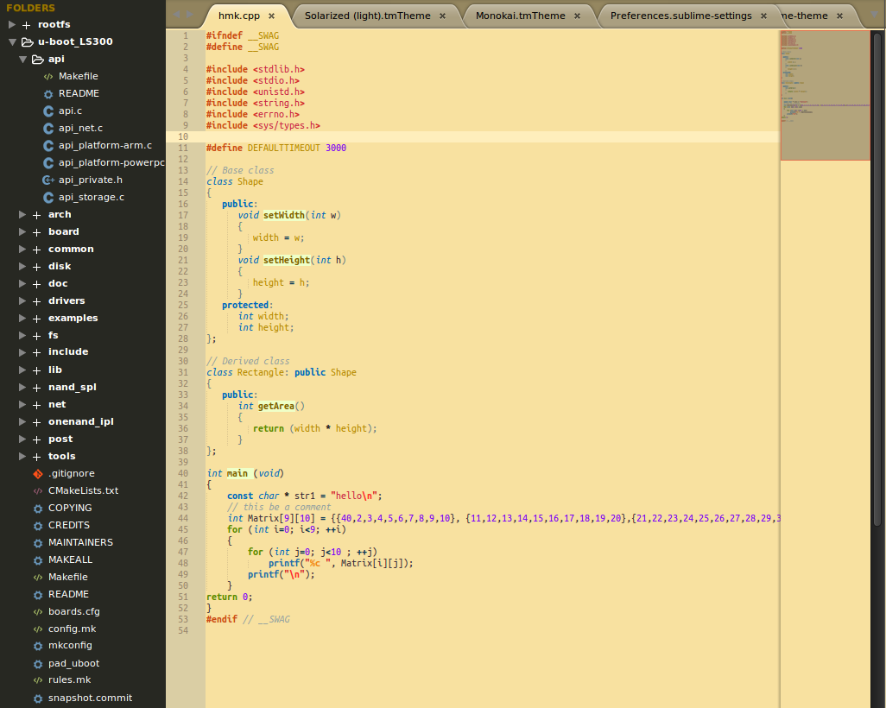
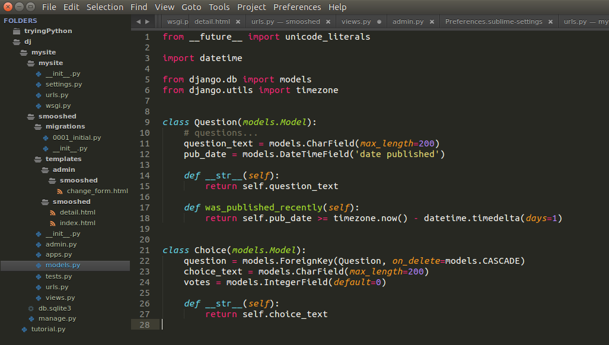

# ST3_Settings
Modified Soda UI theme &amp; minor Custom User settings changes

----------------------Brief---------------------------------------------

These settings are for matching the UI (sidebar) to the Monokai color theme as well as smaller indentation, font changes etc.  but keeping the nice folders icons and tabs from afterglow theme. Also minor user settings changes.

-----------------------How----------------------------------------------

To change UI(sidebar) install "Afterglow theme" package, open the .Afterglow-orange.sublime-theme using "package resource viewer" and copy the contents from here to it, save. then add:
        "theme": "Afterglow-orange.sublime-theme",
to preferences.

To get custom solarized light theme install "Solarized Color Scheme", open the Solarized (light).tmTheme using "package resource viewer" and copy the contents from here to it, save.

